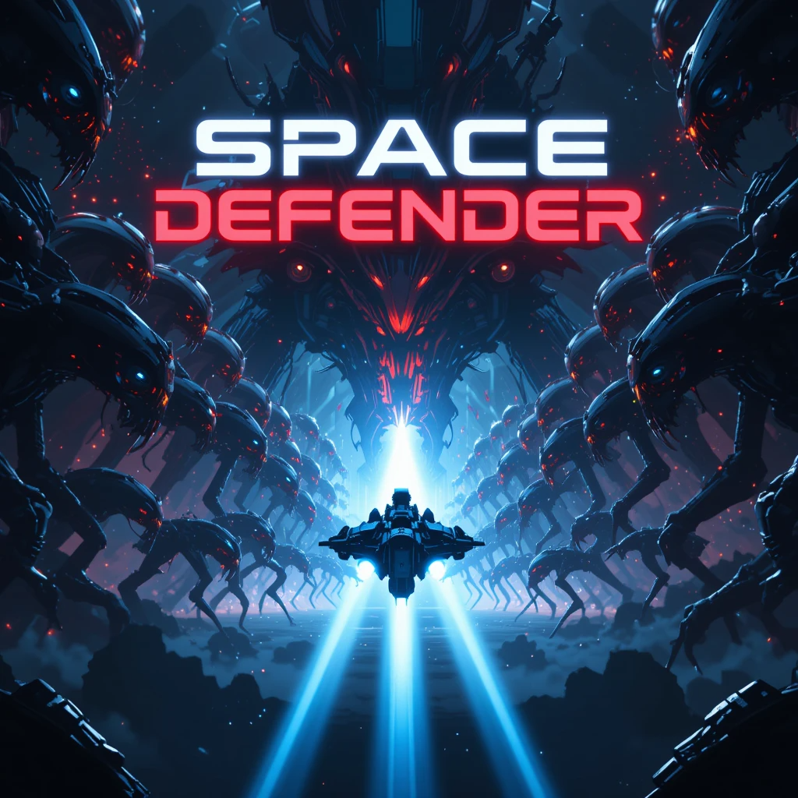

<p align="center">
  
</p>

<h1 align="center">Space Defender 🚀</h1>

A fast-paced **2D space shooter game** built in **Java Swing**.  
Dodge enemy fire, collect power-ups, and blast your way to victory in this retro-inspired arcade game!

---

## 🎮 Features

- 🕹️ Smooth Java 2D animations and keyboard controls (WASD / Arrow Keys + Spacebar to shoot)
- 👾 Dynamic enemy spawns with increasing difficulty across 7 levels
- 💥 Explosions and collision effects for visual feedback
- ❤️ Health potions to restore HP
- 🛡️ Shield boosts to become temporarily invincible
- 🧠 Enemy shooting and basic AI behavior
- 🎯 Scoring system and kill tracker
- 🏆 Game over screen + "You Win" logic on final level

---

## 🧰 Tech Stack

- Java 17+
- Java Swing (GUI)
- Timer-based game loop
- OOP architecture with clean separation of components (player, enemy, UI, etc.)

---

## 🚀 Getting Started

1. **Clone the repository**
   ```bash
   git clone https://github.com/GitProjsStack/space-defender-java-swing.git
    ```
2. **Go to the project root**
    ```bash
   cd space-defender-java-swing
   ```
3. **Locate `src/main/java/app/Main.java` and run the game**

Enjoy!